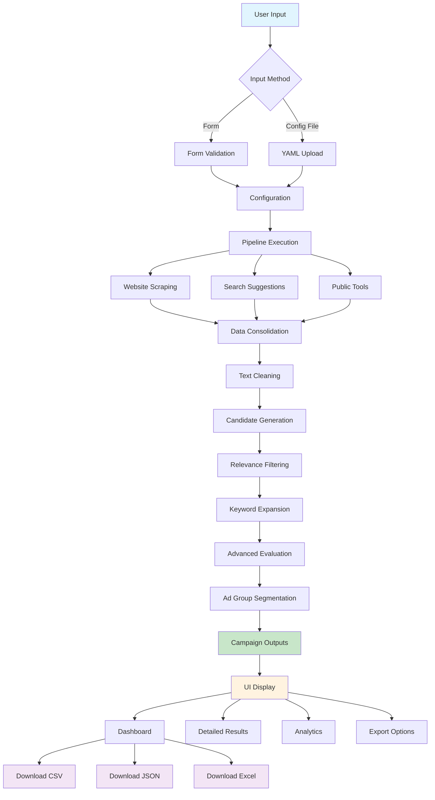
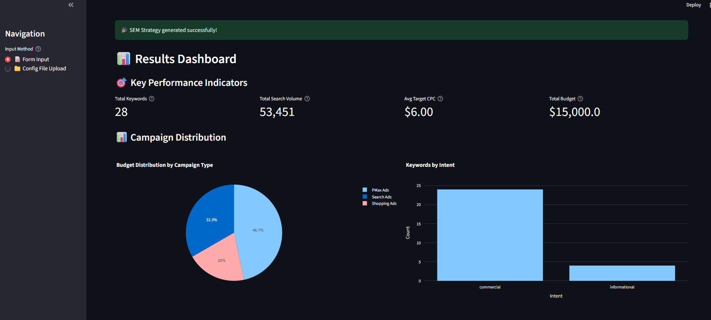
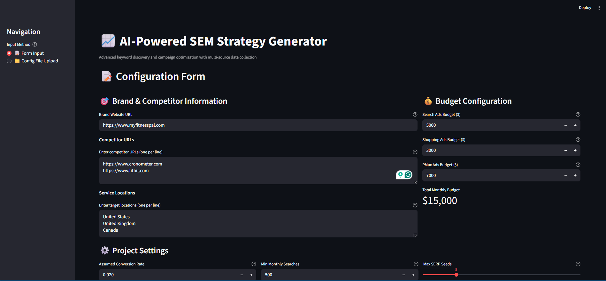
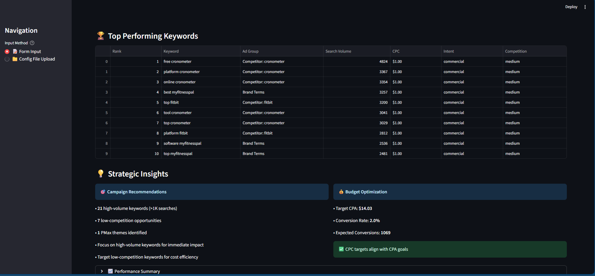
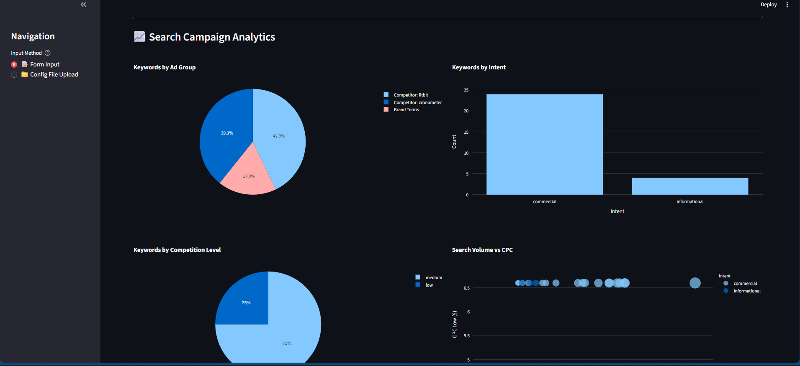
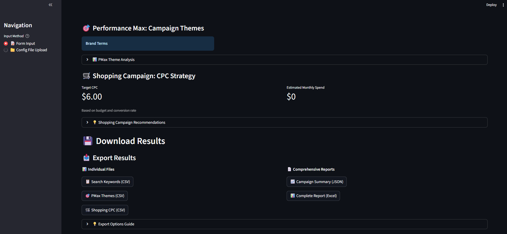
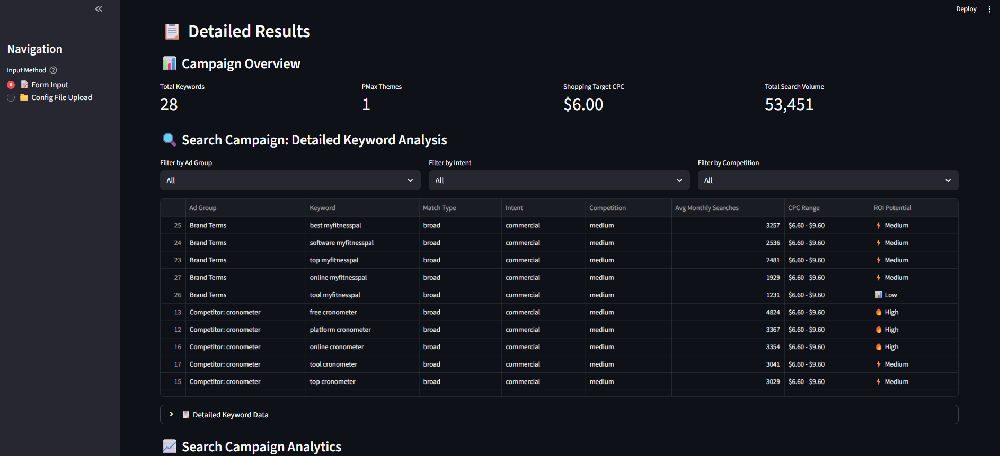

# 🚀 AI-Powered SEM Strategy Generator

**Advanced keyword discovery and campaign optimization with multi-source data collection and comprehensive UI**

[](https://python.org)
[](https://streamlit.io)
[](LICENSE)

## 📋 Table of Contents

- [🎯 Overview](#-overview)
- [🏗️ Project Structure](#️-project-structure)
- [🔄 System Flow](#-system-flow)
- [✨ Features](#-features)
- [🚀 Quick Start](#-quick-start)
- [📸 Screenshots](#-screenshots)
- [🔧 Detailed Setup](#-detailed-setup)
- [📊 Usage Guide](#-usage-guide)
- [🛠️ Development](#️-development)
- [📈 Advanced Features](#-advanced-features)
- [🔍 Troubleshooting](#-troubleshooting)
- [📄 License](#-license)

## 🎯 Overview

The AI-Powered SEM Strategy Generator is a comprehensive tool that creates structured SEM plans using Search, Shopping, and Performance Max campaigns. It leverages advanced AI and multi-source data collection to generate actionable keyword strategies without requiring Google Ads API access.

### Key Capabilities

- **Multi-Source Keyword Discovery**: Website scraping, search suggestions, public tools
- **Advanced Analytics**: ROI potential, competition analysis, bid optimization
- **Comprehensive UI**: Interactive dashboard with visualizations and exports
- **Modular Architecture**: Scalable, maintainable codebase
- **Multiple Input Methods**: Form-based and config file upload
- **Professional Deliverables**: CSV, JSON, Excel exports

## 🏗️ Project Structure

```
Cube/
├── 📁 sem_plan/                    # Core SEM planning engine
│   ├── 📁 agents/                  # Specialized AI agents
│   │   ├── 📁 keyword_collectors/  # Data collection modules
│   │   │   ├── website_scraper.py  # Website content extraction
│   │   │   ├── search_suggestions.py # SERP analysis
│   │   │   └── public_tools.py     # Free keyword tools
│   │   ├── 📁 keyword_processors/  # Data processing pipeline
│   │   │   ├── text_cleaner.py     # Content normalization
│   │   │   ├── candidate_generator.py # Keyword generation
│   │   │   ├── relevance_filter.py # Quality filtering
│   │   │   ├── expansion_engine.py # Keyword expansion
│   │   │   ├── scoring_engine.py   # Performance scoring
│   │   │   ├── consolidation_engine.py # Data merging
│   │   │   ├── advanced_evaluation_engine.py # ROI analysis
│   │   │   ├── ad_group_segmentation_engine.py # Campaign grouping
│   │   │   └── deliverables_generator.py # Output creation
│   │   ├── config_agent.py         # Configuration management
│   │   ├── filter_agent.py         # Content filtering
│   │   ├── keyword_agent.py        # Main keyword orchestration
│   │   ├── strategy_agent.py       # Strategic planning
│   │   └── structure_agent.py      # Campaign structuring
│   ├── 📁 core/                    # Core data structures
│   │   ├── types.py                # Data models and types
│   │   └── __init__.py
│   ├── 📁 utils/                   # Utility functions
│   │   ├── cache.py                # Caching mechanisms
│   │   └── http.py                 # HTTP utilities
│   ├── cli.py                      # Command-line interface
│   ├── graph.py                    # Pipeline orchestration
│   ├── llm.py                      # AI/LLM integration
│   ├── pipeline.py                 # Main execution pipeline
│   └── types.py                    # Type definitions
├── 📁 ui/                          # Web interface
│   ├── 📁 components/              # UI components
│   │   ├── form.py                 # Input forms
│   │   ├── results.py              # Results display
│   │   ├── dashboard.py            # Analytics dashboard
│   │   └── downloads.py            # Export functionality
│   ├── app.py                      # Main Streamlit app
│   └── README.md                   # UI documentation
├── 📁 test_outputs/                # Generated deliverables
│   ├── search_campaign_keywords.csv
│   ├── pmax_themes.json
│   ├── shopping_campaign_cpc.csv
│   └── campaign_summary.json
├── config.yaml                     # Configuration template
├── requirements.txt                # Python dependencies
├── test_new_keyword_system.py     # System test script
├── test_ui.py                     # UI test script
├── setup_new_system.py            # Setup script
└── README.md                       # This file
```

## 🔄 System Flow



### Data Processing Pipeline

```mermaid
graph LR
    A[Raw Keywords] --> B[Text Cleaning]
    B --> C[Candidate Generation]
    C --> D[Relevance Filtering]
    D --> E[Keyword Expansion]
    E --> F[Data Consolidation]
    F --> G[Advanced Evaluation]
    G --> H[Ad Group Segmentation]
    H --> I[Campaign Outputs]

    style A fill:#ffcdd2
    style I fill:#c8e6c9
```



## ✨ Features

### 🎯 **Core Functionality**

- **Multi-Source Data Collection**: Website scraping, SERP analysis, public tools
- **Advanced Keyword Processing**: AI-powered filtering and expansion
- **Intelligent Scoring**: ROI potential, competition analysis, bid optimization
- **Campaign Segmentation**: Automatic ad group creation and PMax themes
- **Comprehensive Analytics**: Visual charts, performance metrics, strategic insights

### 🖥️ **User Interface**

- **Dual Input Methods**: Interactive forms and config file upload
- **Real-time Progress**: Pipeline execution tracking
- **Interactive Dashboards**: KPIs, charts, and analytics
- **Filterable Results**: Dynamic keyword filtering and sorting
- **Multiple Export Formats**: CSV, JSON, Excel with professional formatting

### 📊 **Deliverables**

- **Search Campaign Keywords**: Ad groups, match types, CPC ranges
- **PMax Themes**: Categorized campaign themes for Performance Max
- **Shopping CPC Strategy**: Target CPC calculations and recommendations
- **Strategic Insights**: AI-generated optimization recommendations

## 🚀 Quick Start

### Prerequisites

- Python 3.10+
- Git
- Modern web browser

### Installation

```bash
# Clone the repository
git clone <repository-url>
cd Cube

# Create virtual environment
python -m venv .venv

# Activate virtual environment
# Windows:
.\.venv\Scripts\Activate.ps1
# macOS/Linux:
source .venv/bin/activate

# Install dependencies
pip install -r requirements.txt

# Run the UI
streamlit run ui/app.py
```

The application will open at `http://localhost:8501`

## 📸 Screenshots

### Main Dashboard


_Comprehensive overview with KPIs, budget distribution, and strategic insights_

### Input Configuration


_Dual input methods: form-based configuration and YAML file upload_

### Keyword Analysis


_Detailed keyword table with filtering, sorting, and ROI analysis_

### Analytics Dashboard


_Interactive charts showing ad group distribution, intent analysis, and competition breakdown_

### Export Options


_Multiple export formats: CSV, JSON, and Excel with professional formatting_

### Results Summary


_Campaign summary with performance metrics and strategic recommendations_

## 🔧 Detailed Setup

### 1. Environment Setup

#### Windows PowerShell

```powershell
# Install Python 3.10+ from python.org
# Verify installation
python --version

# Clone repository
git clone <repository-url>
cd Cube

# Create virtual environment
python -m venv .venv

# Activate environment
.\.venv\Scripts\Activate.ps1

# Upgrade pip
python -m pip install --upgrade pip

# Install dependencies
pip install -r requirements.txt
```

#### macOS/Linux

```bash
# Install Python 3.10+
brew install python@3.10  # macOS
sudo apt install python3.10  # Ubuntu

# Clone and setup
git clone <repository-url>
cd Cube
python3 -m venv .venv
source .venv/bin/activate
pip install -r requirements.txt
```

### 2. Configuration

#### Basic Configuration

Edit `config.yaml`:

```yaml
brand_url: "https://www.yourwebsite.com"
competitor_urls:
  - "https://www.competitor1.com"
  - "https://www.competitor2.com"
service_locations:
  - "United States"
  - "United Kingdom"
ad_budgets:
  search_ads_budget: 5000
  shopping_ads_budget: 3000
  pmax_ads_budget: 7000
project_settings:
  assumed_conversion_rate: 0.02
  min_search_volume_threshold: 500
```

#### Advanced Configuration

```yaml
# Optional: Google Gemini API for enhanced results
project_settings:
  assumed_conversion_rate: 0.02
  min_search_volume_threshold: 500
  target_cpa: 50.0
  max_keywords_per_ad_group: 20
  enable_llm_enhancement: true
```

### 3. Running the Application

#### Web Interface (Recommended)

```bash
streamlit run ui/app.py
```

#### Command Line Interface

```bash
python -m sem_plan.cli --config config.yaml --out outputs
```

#### Test Scripts

```bash
# Test the keyword system
python test_new_keyword_system.py

# Test UI components
python test_ui.py
```

### 4. Dependencies

#### Core Dependencies

- **requests**: HTTP requests for web scraping
- **beautifulsoup4**: HTML parsing
- **pandas**: Data manipulation and analysis
- **streamlit**: Web interface framework
- **plotly**: Interactive visualizations

#### Advanced Dependencies

- **playwright**: Headless browser automation
- **spacy**: Natural language processing
- **scikit-learn**: Machine learning algorithms
- **sentence-transformers**: Semantic similarity
- **openpyxl**: Excel file generation

#### Optional Dependencies

- **langchain**: LLM integration
- **langchain-google-genai**: Google Gemini API

## 📊 Usage Guide

### 1. Getting Started

1. **Launch the Application**

   ```bash
   streamlit run ui/app.py
   ```

2. **Choose Input Method**

   - **Form Input**: Fill out the interactive form
   - **Config File Upload**: Upload your YAML configuration

3. **Configure Settings**

   - Brand website URL
   - Competitor URLs
   - Service locations
   - Budget allocation
   - Project parameters

4. **Run Analysis**
   - Click "Generate SEM Strategy"
   - Monitor progress in real-time
   - Wait for completion (2-5 minutes)

### 2. Understanding Results

#### Dashboard Overview

- **Total Keywords**: Number of discovered keywords
- **PMax Themes**: Generated campaign themes
- **Shopping Target CPC**: Recommended cost-per-click
- **Total Search Volume**: Combined monthly searches

#### Keyword Analysis

- **Ad Groups**: Automatic keyword clustering
- **Match Types**: Recommended match types (Broad, Phrase, Exact)
- **CPC Ranges**: Bid recommendations based on competition
- **ROI Potential**: Performance scoring (High, Medium, Low)

#### Strategic Insights

- **High-Volume Keywords**: Keywords with >1K monthly searches
- **Low-Competition Opportunities**: Cost-efficient targeting
- **Budget Optimization**: CPA alignment and recommendations

### 3. Export Options

#### Individual Files (CSV)

- **Search Keywords**: Complete keyword list for Google Ads import
- **PMax Themes**: Campaign themes and categories
- **Shopping CPC**: CPC recommendations and analysis

#### Comprehensive Reports

- **JSON Summary**: Complete analysis for API integration
- **Excel Report**: Multi-sheet report with all data

### 4. Best Practices

#### Configuration

- Use realistic competitor URLs
- Set appropriate budget allocations
- Adjust conversion rates based on industry benchmarks
- Consider geographic targeting

#### Analysis

- Review high-volume keywords first
- Focus on low-competition opportunities
- Monitor CPC ranges for budget alignment
- Use PMax themes for broad reach campaigns

#### Implementation

- Start with exact match keywords
- Gradually expand to phrase and broad match
- Monitor performance and adjust bids
- Use exported data for Google Ads setup

## 🛠️ Development

### Project Architecture

#### Modular Design

The system uses a modular architecture with specialized components:

```
Core Engine (sem_plan/)
├── Agents: Specialized processing modules
├── Collectors: Data gathering components
├── Processors: Data transformation pipeline
└── Utils: Shared utilities and helpers

UI Layer (ui/)
├── Components: Reusable UI modules
├── Forms: Input handling and validation
├── Results: Data visualization and display
└── Exports: File generation and downloads
```

#### Data Flow

1. **Input Collection**: Form or file upload
2. **Validation**: Configuration verification
3. **Pipeline Execution**: Multi-step processing
4. **Results Generation**: Campaign outputs
5. **UI Display**: Interactive visualization
6. **Export**: File generation and download

### Adding New Features

#### 1. New Data Source

```python
# Create new collector in sem_plan/agents/keyword_collectors/
class NewSourceCollector:
    def collect_keywords(self, config):
        # Implementation
        pass
```

#### 2. New Processing Step

```python
# Add processor in sem_plan/agents/keyword_processors/
class NewProcessor:
    def process_keywords(self, keywords):
        # Implementation
        pass
```

#### 3. New UI Component

```python
# Create component in ui/components/
def render_new_component(data):
    # Implementation
    pass
```

### Testing

#### Unit Tests

```bash
# Test individual components
python -m pytest tests/unit/

# Test integration
python -m pytest tests/integration/
```

#### System Tests

```bash
# Test complete pipeline
python test_new_keyword_system.py

# Test UI components
python test_ui.py
```

### Code Quality

#### Linting

```bash
# Install pre-commit hooks
pre-commit install

# Run linting
flake8 sem_plan/ ui/
black sem_plan/ ui/
```

#### Type Checking

```bash
# Run type checker
mypy sem_plan/ ui/
```

## 📈 Advanced Features

### 1. LLM Integration

#### Google Gemini API

```bash
# Set environment variable
export GEMINI_API_KEY="your_api_key_here"

# Enhanced results with AI analysis
```

#### Custom LLM Providers

```python
# Configure in sem_plan/llm.py
class CustomLLMProvider:
    def analyze_keywords(self, keywords):
        # Custom analysis logic
        pass
```

### 2. Advanced Analytics

#### Custom Scoring Models

```python
# Implement in sem_plan/agents/keyword_processors/scoring_engine.py
class CustomScoringModel:
    def calculate_score(self, keyword):
        # Custom scoring logic
        pass
```

#### Performance Tracking

```python
# Add metrics collection
class PerformanceTracker:
    def track_metrics(self, campaign_data):
        # Performance analysis
        pass
```

### 3. API Integration

#### REST API

```python
# Create API endpoints
from fastapi import FastAPI

app = FastAPI()

@app.post("/generate-strategy")
async def generate_strategy(config: Config):
    # Strategy generation
    pass
```

#### Google Ads API

```python
# Direct Google Ads integration
class GoogleAdsConnector:
    def create_campaign(self, campaign_data):
        # Campaign creation
        pass
```

## 🔍 Troubleshooting

### Common Issues

#### Installation Problems

```bash
# Clear cache and reinstall
pip cache purge
pip install -r requirements.txt --force-reinstall

# Check Python version
python --version  # Should be 3.10+
```

#### Import Errors

```bash
# Verify virtual environment
which python  # Should point to .venv/

# Reinstall dependencies
pip install -r requirements.txt
```

#### Memory Issues

```yaml
# Reduce processing load in config.yaml
project_settings:
  max_serp_queries: 5 # Reduce from default 10
  max_keywords_per_ad_group: 10 # Reduce from default 20
```

#### Network Issues

```python
# Configure timeouts in sem_plan/utils/http.py
TIMEOUT = 30  # Increase timeout for slow sites
RETRY_ATTEMPTS = 3  # Increase retry attempts
```

### Performance Optimization

#### Large Datasets

- Reduce `max_serp_queries` parameter
- Use `min_search_volume_threshold` filtering
- Enable caching for repeated analysis

#### UI Performance

- Limit chart data points
- Use pagination for large tables
- Enable Streamlit caching

#### Memory Management

- Process data in batches
- Clear unused variables
- Monitor memory usage

### Debug Mode

#### Enable Debug Logging

```python
# Add to config.yaml
debug:
  enable_logging: true
  log_level: DEBUG
  save_intermediate_results: true
```

#### Debug UI

```bash
# Run with debug flags
streamlit run ui/app.py --logger.level=debug
```

## 📄 License

This project is for internal use only. Please ensure compliance with all third-party site terms of service when using web scraping features.

### Third-Party Licenses

- **Streamlit**: Apache 2.0
- **Pandas**: BSD 3-Clause
- **Plotly**: MIT
- **Playwright**: Apache 2.0
- **spaCy**: MIT

### Usage Guidelines

- Respect robots.txt files
- Implement polite delays between requests
- Use data responsibly and ethically
- Comply with website terms of service

---

**Version 2.0** - Advanced keyword research with sophisticated data consolidation, intelligent scoring, and comprehensive campaign deliverables.

**Last Updated**: December 2024
**Maintainer**: AI Development Team
